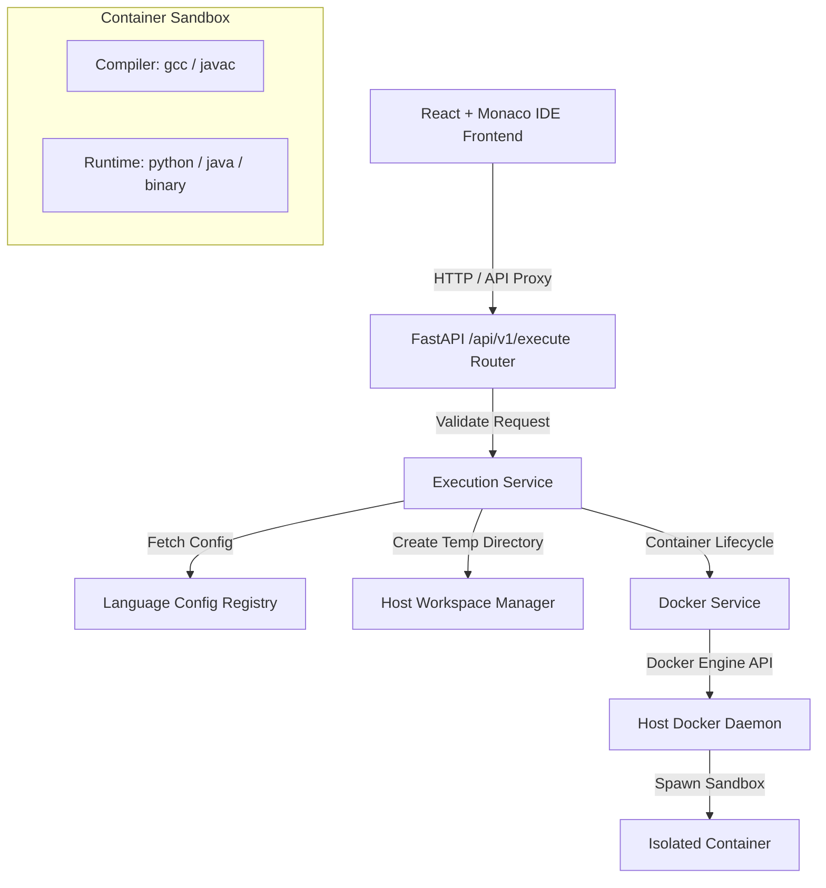

# System Architecture Document

## Overview
Module 1 of the College Programming Laboratory & Examination Platform provides a secure, browser-based coding environment that executes untrusted student code inside isolated, resource-constrained Docker containers.

## Core Components

### 1. Frontend Layer (`frontend/`)
* **Framework:** React + Vite + TypeScript
* **Code Editor:** Monaco Editor (`@monaco-editor/react`) with VS-Dark syntax highlighting.
* **Controls:** Language selection (Python 3.11, Java 17, C++ GCC), loading-state Run button, Clear button, and stdin input textarea.
* **Result View:** Real-time execution status badges (`COMPLETED`, `COMPILATION_ERROR`, `RUNTIME_ERROR`, `TIME_LIMIT_EXCEEDED`, `MEMORY_LIMIT_EXCEEDED`, `OUTPUT_LIMIT_EXCEEDED`, `SYSTEM_ERROR`), execution time in ms, exit codes, and colored stdout/stderr streams.

### 2. API Layer (`backend/app/api/`)
* **Framework:** FastAPI + Pydantic v2
* **Role:** Thin request router. Validates incoming payload shapes, delegates execution to `ExecutionService`, and converts internal domain results to structured OpenAPI HTTP responses without exposing host internals.

### 3. Execution Service (`backend/app/services/execution_service.py`)
* **Role:** Generic orchestrator. Driven strictly by language configuration objects (`LanguageConfig`).
* **Responsibilities:**
  - Enforces source code size (<100KB) and stdin size (<100KB) caps before touching Docker.
  - Generates unique tracking IDs (`exec_<uuid>`).
  - Provisions isolated temporary workspace directories on the host.
  - Drives optional compilation and execution phases inside containers.
  - Enforces output caps (1MB) and handles process exit codes (including OOM exit code `137`).
  - Guarantees container termination and directory deletion via `try...finally` blocks.

### 4. Docker Service (`backend/app/services/docker_service.py`)
* **Interface:** Docker SDK for Python (`docker` package).
* **Security Controls:**
  - Network: `network_disabled=True`
  - Memory: `mem_limit="256m"`, `memswap_limit="256m"`
  - CPU: `nano_cpus=1000000000` (1 core)
  - Process Limit: `pids_limit=64`
  - Linux Capabilities: `cap_drop=["ALL"]`
  - Privilege Escalation: `security_opt=["no-new-privileges:true"]`
  - Non-root User: `user="1000:1000"` (`sandbox` user)

### 5. Language Configuration System (`backend/app/models/language_config.py`)
No `if/elif` branching exists in the execution engine. Supported languages are registered as config items:
- **Python:** `college-code-python:3.11`, `main.py`, compile: `null`, run: `["python", "main.py"]`
- **Java:** `college-code-java:17`, `Main.java`, compile: `["javac", "Main.java"]`, run: `["java", "Main"]`
- **C++:** `college-code-cpp:gcc`, `main.cpp`, compile: `["g++", "main.cpp", "-O2", "-o", "main"]`, run: `["./main"]`
