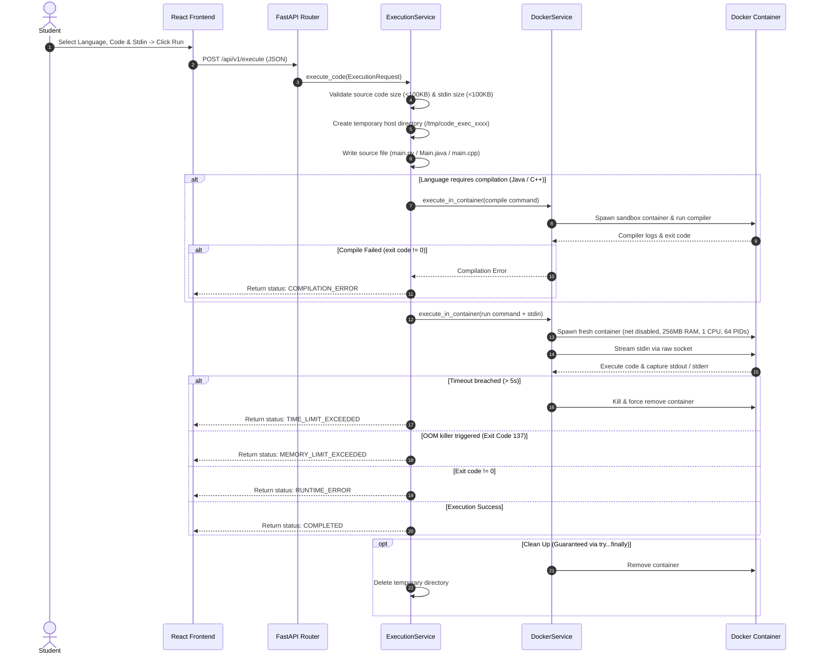

# Execution Flow Document

## Detailed Execution Sequence

## Status Classification Matrix

| Status | Trigger Condition | Output Returned |
| :--- | :--- | :--- |
| `COMPLETED` | Exit Code `0`, no limits breached | Captured `stdout`, empty `stderr` |
| `COMPILATION_ERROR` | Compiler (`javac` / `g++`) exit code != 0 | Compiler error logs (`stderr`) |
| `RUNTIME_ERROR` | Runtime crash, unhandled exception, segfault | Exception traceback / error log |
| `TIME_LIMIT_EXCEEDED` | Process wall-clock execution > 5s | Truncated logs prior to kill |
| `MEMORY_LIMIT_EXCEEDED` | RAM allocation > 256MB (Exit code 137) | OOM notice & stderr logs |
| `OUTPUT_LIMIT_EXCEEDED` | `stdout` / `stderr` > 1MB | Truncated log block + cap notice |
| `SYSTEM_ERROR` | Invalid language or source/stdin size breach | Generic sanitized system error |
